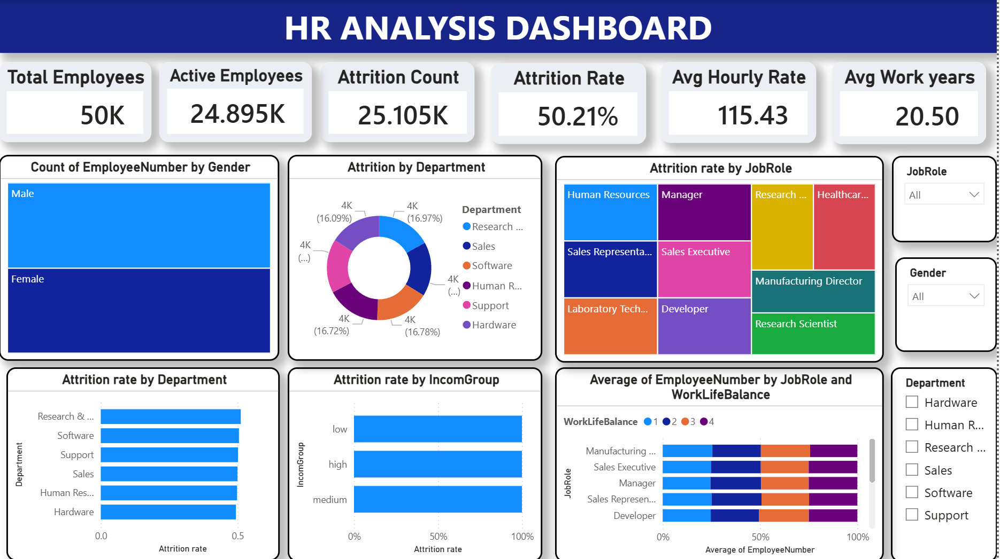

# HR Analysis Dashboard
## 📌 Project Overview
This Power BI dashboard provides detailed insights into employee attrition, workforce demographics, and HR performance metrics to support better business decision-making.
---
## 🛠 Tools & Technologies
- Power BI
- Excel
- DAX
---
## 📊 Key Performance Indicators (KPIs)
- Total Employees
- Attrition Count
- Attrition Rate
- Average Salary
- Employee Demographics
---
## 🔍 Dashboard Insights
- Department-wise Attrition Analysis
- Gender Distribution Analysis
- Age Group Analysis
- Workforce Trends
---
## 🖼 Dashboard Preview

